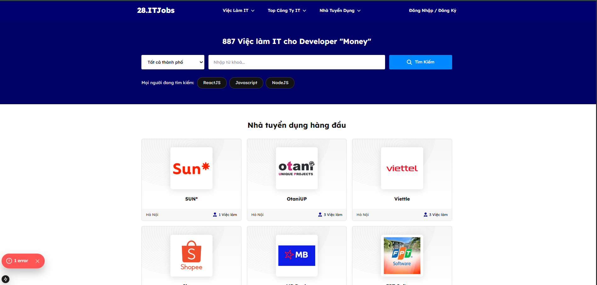
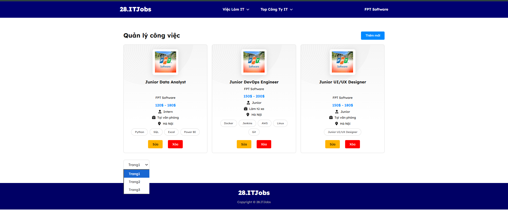
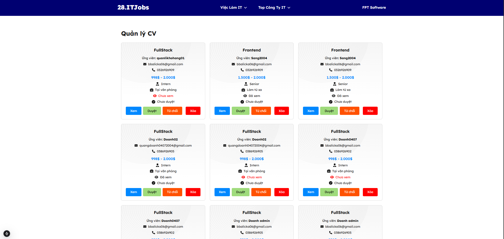
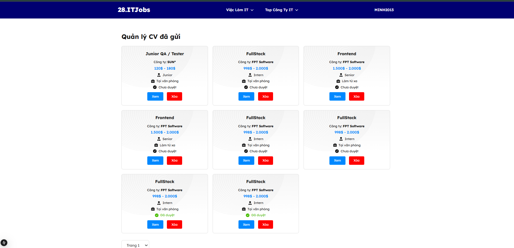

# IT Job Seek

Website giúp người dùng tìm kiếm, ứng tuyển và quản lý việc làm trong ngành IT.  
Dự án được xây dựng bằng **Node.js + Express.js + MongoDB**, Frontend **Next.js**.

---

## Giới thiệu

IT Job Seek là một hệ thống quản lý việc làm IT toàn diện.

**Người dùng có thể:**
- Tìm kiếm và ứng tuyển các vị trí công việc IT.
- Quản lý hồ sơ cá nhân và theo dõi trạng thái ứng tuyển.

**Nhà tuyển dụng có thể:**
- Đăng tin tuyển dụng và quản lý ứng viên.
- Tìm kiếm và phản hồi ứng tuyển phù hợp.

---
# Hình ảnh giao diện
Giao diện đăng nhập 

Giao diện trang chủ 

Trang quản lý công việc của nhà tuyển dụng

Trang quản lý CV  của nhà tuyển dụng

Trang quản lý CV của ứng viên

## Công nghệ

| Thành phần                 | Công nghệ                              |
|----------------------------|---------------------------------------|
| **Ngôn ngữ**               | Node.js (Express.js Framework), TypeScript |
| **Giao diện**              | Next.js, TypeScript, Tailwind CSS     |
| **Cơ sở dữ liệu**          | MongoDB                               |
| **Upload file / hình ảnh** | Cloudinary + Multer                   |
| **Bảo mật & xác thực**     | bcryptjs, jsonwebtoken                |
| **Xử lý dữ liệu / file**   | moment, Joi                           |
| **Môi trường**             | dotenv, cookie-parser                  |

---

## Các Chức năng 

- Tìm kiếm và ứng tuyển các vị trí IT.  
- Quản lý hồ sơ cá nhân và CV.  
- Quản lý ứng viên cho nhà tuyển dụng.  
- Upload hồ sơ, hình ảnh và file đính kèm.  
- Xác thực, bảo mật bằng JWT và bcrypt.  
- Ứng viên biết được trạng thái cv đã nộp(đã duyệt, từ chối,...).

---

## Dự án này thể hiện kỹ năng của tôi trong việc:

- Xây dựng **RESTful API** với Node.js, Express và MongoDB.  
- Tạo **giao diện Frontend hiện đại** với Next.js và Tailwind CSS và 1 số thư viện hỗ trợ.  
- **Quản lý người dùng, xác thực và bảo mật** bằng JWT, bcrypt và cookie-parser.  
- **Xử lý file & hình ảnh** với Multer và Cloudinary.  
- Thiết kế **quản lý dữ liệu** cho nhà tuyển dụng và ứng viên.  
- Quản lý **dữ liệu thời gian thực** và định dạng ngày giờ với moment.js.  
- Xây dựng **hệ thống kiểm tra dữ liệu đầu vào** với Joi.  